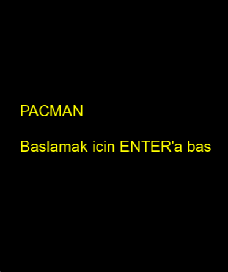
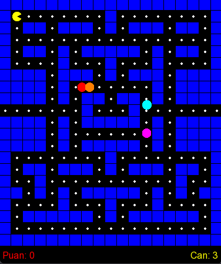
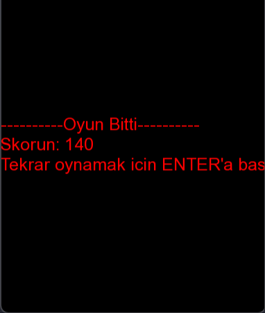
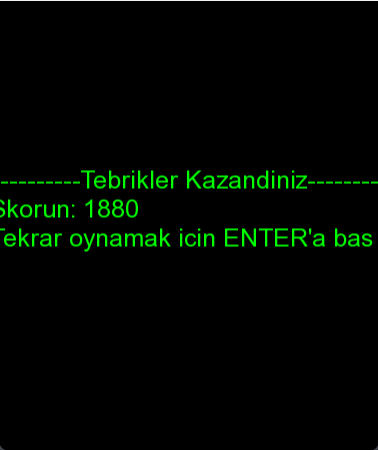

# 🕹️ SFML 2.6.2 - Pacman Game

Bu proje, C++ programlama dili ve **SFML 2.6.2 (Simple and Fast Multimedia Library)** kütüphanesi kullanılarak Visual Studio Code ortamında geliştirilmiş klasik bir Pacman klonudur.

---

## 📸 Ekran Görüntüleri






---

## 🚀 Proje Özellikleri

* **Gelişmiş Yapay Zeka (AI):** Blinky, Pinky, Inky ve Clyde hayaletleri farklı hareket algoritmalarına sahiptir. Blinky doğrudan Pacman'i takip ederken, diğer hayaletler haritada rastgele dolaşır.
* **Tünel Mekaniği (Işınlanma):** Haritanın sol ve sağ tarafındaki tünel çıkışları pürüzsüz bir ışınlanma döngüsüne sahiptir. Karakterler sınıra geldiğinde takılmadan karşı taraftan beliriş yapar.
* **Ses Efektleri ve Müzik:** SFML Audio modülü kullanılarak oyuna arka plan müziği, nokta yeme sesi ve ölüm animasyonu ses efekti entegre edilmiştir.
* **Dinamik Ağız Animasyonu:** Pacman hareket ederken `sf::ConvexShape` kullanılarak matematiksel olarak hesaplanan dinamik bir ağız açma/kapama animasyonu oynatılır. Hareket yönüne göre Pacman otomatik olarak döner.
* **Oyun Durumları (State Machine):** Başlangıç, Oynanış, Oyun Bitti ve Kazanma ekranları arası geçiş kontrolü sağlanmıştır.

---

## 🎮 Kontroller

* **YÖN TUŞLARI (Yukarı, Aşağı, Sol, Sağ):** Pacman'i yönlendirir.
* **ENTER:** Başlangıç ekranında oyunu başlatır; oyun bittiğinde veya kazanıldığında oyunu sıfırlayıp yeniden başlatır.
* **ESC:** Oyunu pürüzsüz bir şekilde kapatır.

---

## 🛠️ Gereksinimler ve Medya Dosyaları

Projenin sorunsuz çalışabilmesi için derlenen `.exe` dosyası ile **aynı klasörde** aşağıdaki medya dosyalarının bulunması zorunludur:
* 📁 `arial.ttf` *(Yazı tipi)*
* 📁 `freesound_community-playing-pac-man-6783.mp3` *(Arka plan müziği)*
* 📁 `nahtt-eat-323883.mp3` *(Nokta yeme ses efekti)*
* 📁 `8d82b5_pacman_dies_sound_effect.mp3` *(Ölüm ses efekti)*

---

## 💻 Derleme ve Çalıştırma

Projede Visual Studio Code'un otomatik görev yöneticisi yapılandırılmıştır. Elle terminale uzun komutlar yazmanıza gerek yoktur.

1. Bu proje klasörünü **VS Code** ile açın.
2. Bilgisayarınızda **MinGW (C++ Derleyicisi)** ve **SFML 2.6.2** kütüphanelerinin kurulu olduğundan, `.vscode/tasks.json` yollarınızın doğru olduğundan emin olun.
3. Projeyi derlemek için **`Ctrl + Shift + B`** kısayolunu kullanın.
4. Oyunu başlatmak ve test etmek için **`F5`** tuşuna basın.

> ⚠️ **Önemli Not:** Eğer oyun açılır açılmaz çöküyorsa, SFML'e ait gerekli `.dll` dosyalarını (özellikle ses için gereken `openal32.dll` dahil) ve yukarıdaki medya dosyalarını derlenen `.exe` dosyasının yanına kopyaladığınızdan emin olun.

---

## 📝 Harita Yapısı (Grid)

Oyun alanı `21x19` boyutlarında bir matris (`map[MAP_ROWS][MAP_COLS]`) üzerinden dinamik olarak çizilir:
* **1:** Mavi Renkli Duvarlar
* **0:** Yenebilir Küçük Noktalar
* **2:** Boş Yol (Pacman'in başlangıç noktası)

---

## 📂 Klasör Yapısı

Projenin derlenebilmesi ve medya dosyalarının eksiksiz yüklenmesi için klasör düzeni aşağıdaki gibi olmalıdır:

```text
Pacman-SFML/
│
├── .git/                                # Git versiyon kontrol klasörü
├── .vscode/                             # VS Code derleme ayarları
│   ├── tasks.json
│   └── launch.json
│
├── src/                                 # Proje kaynak kod klasörü
├── main.cpp                             # Oyunun ana kaynak kodu
│
├── CMakeLists.txt                       # CMake yapılandırma dosyası
├── .gitignore                           # Git takip dışı listesi
├── InstallationLog.txt                  # Kurulum günlük dosyası
│
├── pacman.exe                           # Derlenmiş oyun uygulaması
│
├── arial.ttf                            # Skor ve can yazıları için font
├── freesound_community-playing-pac-man-6783.mp3  # Arka plan müziği
├── nahtt-eat-323883.mp3                 # Nokta yeme ses efekti
├── 8d82b5_pacman_dies_sound_effect.mp3  # Ölüm ses efekti
│
├── openal32.dll                         # SFML Ses modülü için gerekli kütüphane
├── libgcc_s_seh-1.dll                   # Derleyici çalışma zamanı kütüphanesi
├── libstdc++-6.dll                      # C++ standart kütüphanesi
├── libwinpthread-1.dll                  # Windows thread kütüphanesi
│
└── sfml-*.dll                           # SFML Dinamik kütüphane dosyaları
    ├── sfml-audio-2.dll                 # (Klasördeki sfml-audio-d-2.dll gibi)
    ├── sfml-graphics-2.dll              # (bütün debug ve release sürümleri dahil)
    ├── sfml-network-2.dll
    ├── sfml-system-2.dll
    └── sfml-window-2.dll